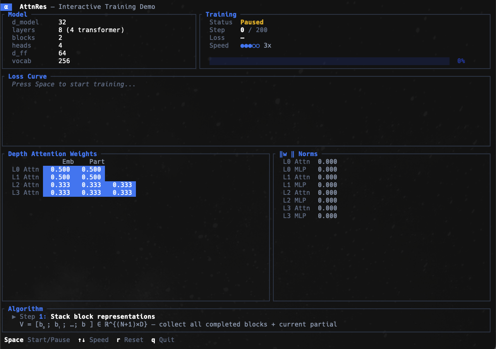
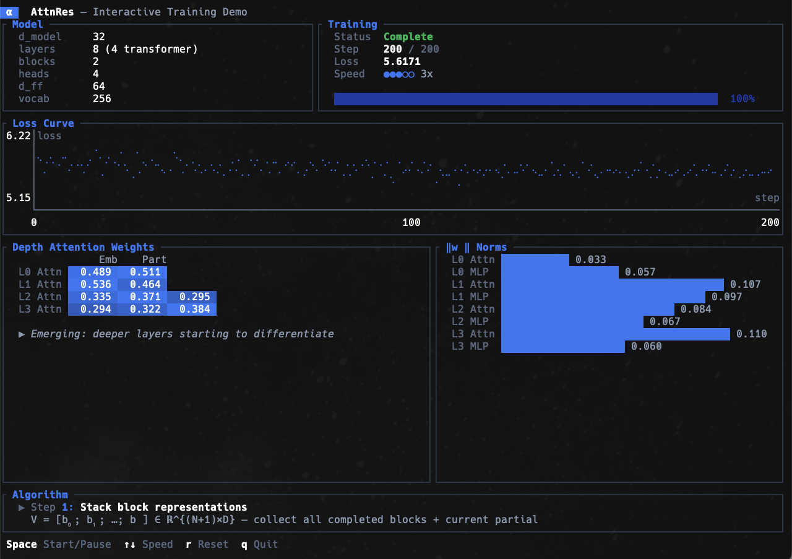
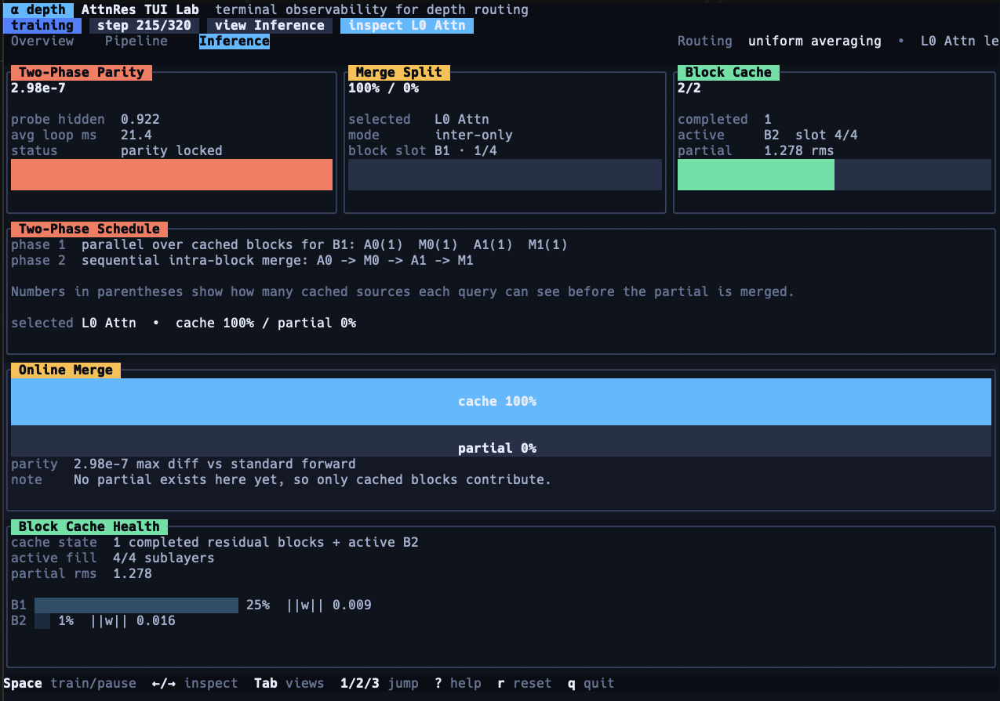
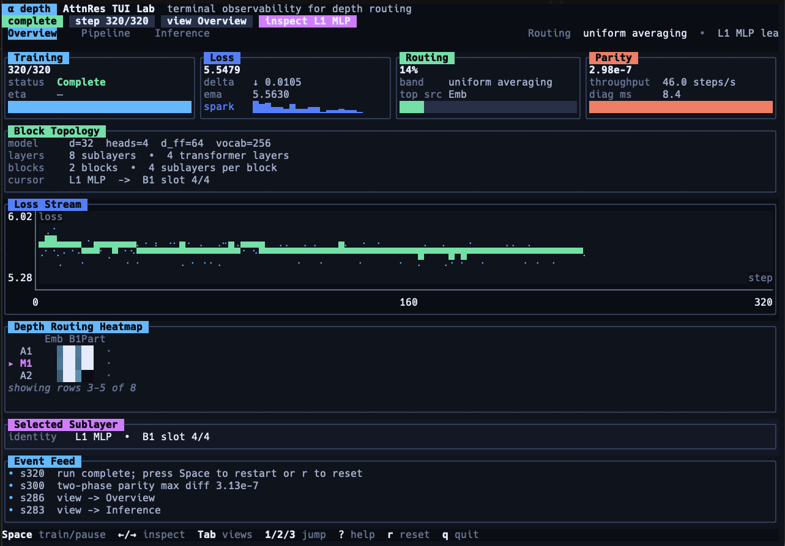

<p align="center">
  <strong>attnres</strong>
</p>

<p align="center">
  <em>Learned depth attention for Transformers. Replaces fixed residual connections with softmax attention over layers.</em>
</p>

<p align="center">
  <a href="https://github.com/AbdelStark/attnres/actions"></a>
  <a href="https://crates.io/crates/attnres"></a>
  <a href="https://docs.rs/attnres"></a>
  <a href="LICENSE"></a>
</p>

---

The first Rust implementation of [**Attention Residuals**](https://github.com/MoonshotAI/Attention-Residuals) (MoonshotAI / Kimi). Built on [burn](https://github.com/tracel-ai/burn). Runs on CPU, CUDA, Metal, and wgpu.

Standard residual connections add every layer's output with equal weight. In deep networks, this dilutes early representations and offers no mechanism to *choose* which layers matter. **AttnRes** replaces the fixed `h + F(h)` with a learned softmax over all prior block representations, giving each layer selective, content-aware access to the full depth of the network.

The result: **1.25x compute advantage** at **< 2% inference overhead**.

## How It Works

```
Standard Residual              Attention Residual
─────────────────              ──────────────────
h = h_l + F(h_l)              V = [b₀; b₁; …; bₙ]      ← stack all blocks
    └─ fixed +1               K = RMSNorm(V)             ← normalize keys
                               α = softmax(K · w_l)      ← depth attention
                               h = Σ αᵢ · Vᵢ             ← weighted combination
```

Each transformer layer has **two** AttnRes operations (before self-attention and before MLP), each with its own learned pseudo-query vector **w_l** initialized to zero. At initialization, all available sources receive equal weight. During training, the model learns to selectively route information from the most relevant depths.

## Quick Start

```toml
[dependencies]
attnres = "0.1"
burn = { version = "0.20", features = ["ndarray"] }
```

```rust
use attnres::{AttnResConfig, AttnResTransformer};
use burn::prelude::*;
use burn::backend::NdArray;

type B = NdArray;

let device = Default::default();
let config = AttnResConfig::new(128, 8, 2)  // d_model, 8 sublayers, 2 blocks
    .with_num_heads(4)
    .with_vocab_size(1000);

let model: AttnResTransformer<B> = config.init_model(&device);
let input = Tensor::<B, 2, Int>::zeros([1, 16], &device);
let logits = model.forward(input, None);  // [1, 16, 1000]
```

## Interactive TUI Demo

Watch the algorithm come alive. The TUI demo trains a model in real time and visualizes depth attention patterns evolving from uniform to selective:

```bash
cargo run --example demo_tui --release
```

<table>
  <tr>
    <td width="50%" align="center">
      
      <br />
      <sub><strong>1. Overview</strong> — live training telemetry, block topology, routing heatmap, and event feed.</sub>
    </td>
    <td width="50%" align="center">
      
      <br />
      <sub><strong>2. Pipeline</strong> — selected sublayer drilldown, pre-softmax scores, routing mass, and the 5-step AttnRes trace.</sub>
    </td>
  </tr>
  <tr>
    <td width="50%" align="center">
      
      <br />
      <sub><strong>3. Inference</strong> — two-phase scheduling, cache-vs-partial merge behavior, and parity checks.</sub>
    </td>
    <td width="50%" align="center">
      
      <br />
      <sub><strong>4. Compact Mode</strong> — condensed terminal layout that keeps the core observability usable in smaller shells.</sub>
    </td>
  </tr>
</table>

**Controls:** `Space` start/pause | `Up/Down` speed | `Left/Right` inspect sublayers | `Tab` or `1/2/3` switch views | `?` help | `r` reset | `q` quit

**What you're seeing:**
- **Overview** — Live training telemetry, loss stream, block topology, routing heatmap, and event feed
- **Pipeline** — Selected sublayer drilldown with pre-softmax logits, routing mass, and a narrated 5-step AttnRes trace
- **Inference** — Two-phase scheduling, cache vs partial merge behavior, and parity checks against standard forward
- **Depth Routing Heatmap** — Actual softmax attention weights computed from the model's pseudo-query vectors and block states. Rows are sublayers, columns are source blocks (`Emb`, `B1`, ..., `Part`)

## Architecture

```
AttnResTransformer
  ├── Token Embedding
  ├── AttnResLayer ×N              ← N = num_layers / 2 (each layer = 2 sublayers)
  │     ├── AttnResOp              ← depth attention before self-attention
  │     │     ├── RMSNorm(V)       ← normalize stacked blocks
  │     │     ├── K · w_l          ← pseudo-query scores each block
  │     │     └── softmax → Σ αV   ← weighted combination
  │     ├── RMSNorm + MultiHeadAttention
  │     ├── AttnResOp              ← depth attention before MLP
  │     └── RMSNorm + FeedForward
  ├── Final RMSNorm
  └── LM Head
```

**Block AttnRes** groups layers into N blocks. With `num_blocks=4` for a 100-layer model, the attention operates over 4 block representations instead of 100 individual layers — keeping overhead minimal while retaining the selective routing benefit.

> **Note on `num_layers`:** This counts *sublayers*. Each transformer layer has 2 sublayers (attention + MLP), so `num_layers=8` creates 4 transformer layers.

## Features

- **Full algorithm** — AttnResOp, BlockState tracking, RMSNorm, block boundary management
- **Two-phase inference** — Batched inter-block + sequential intra-block attention (Algorithm 1 from the paper)
- **Serialization** — Save/load via burn records (NamedMpk, binary, compact half-precision) + JSON config
- **Backend-generic** — Runs on any burn backend: NdArray (CPU), wgpu (cross-platform GPU), CUDA, Metal
- **Zero-cost initialization** — Pseudo-queries start at zero; AttnRes begins as standard residual
- **Comprehensive tests** — 87 tests: unit, differential, property-based (proptest), integration, doctest
- **Interactive demos** — Terminal TUI + browser WASM demo with live visualizations

## Examples

```bash
# Interactive TUI training visualization (recommended first experience)
cargo run --example demo_tui --release

# Train a small model on synthetic data
cargo run --example train_tiny

# Compare standard residuals vs AttnRes on same architecture
cargo run --example compare_residuals

# Visualize depth attention weight patterns
cargo run --example visualize_weights
```

## Web Demo

An interactive browser demo runs the core algorithm via Rust compiled to WebAssembly:

```bash
cd web-demo
npm install
npm run build:wasm   # Requires wasm-pack + wasm32-unknown-unknown target
npm run dev          # localhost:5173
```

Configurable model parameters, live heatmaps, training simulation, and standard vs AttnRes comparison — all running in the browser with no GPU required.

## Development

```bash
cargo build                        # Build
cargo test --all-features          # 87 tests (unit + differential + property + integration + doctest)
cargo clippy -- -D warnings        # Lint
cargo fmt                          # Format
cargo bench                        # Criterion benchmarks
cargo doc --open                   # Documentation
```

## Key Implementation Details

These are the invariants that make AttnRes correct. Getting any of them wrong breaks training:

| Invariant | Why |
|---|---|
| **Zero-init pseudo-queries** | Ensures AttnRes starts as standard residual (uniform 1/N weights). Random init destabilizes training. |
| **Two AttnRes per layer** | One before self-attention, one before MLP. Each has its own w_l. |
| **Softmax over depth** | Attention is over the block/depth dimension (dim=0), NOT the sequence dimension. This is attention over *layers*. |
| **RMSNorm on keys** | Prevents blocks with large accumulated magnitudes from dominating the attention logits. |
| **Cumulative block sums** | `blocks[n]` is the sum of all layer outputs in block n, not individual layer outputs. |

## Project Structure

```
src/
  lib.rs              Public API re-exports
  config.rs           AttnResConfig (builder pattern)
  attn_res_op.rs      Core depth attention operation
  block_state.rs      Block state tracking
  layer.rs            AttnResLayer (2 AttnRes + attention + MLP)
  model.rs            AttnResTransformer (full model)
  rms_norm.rs         RMSNorm (3D + 4D)
  attention.rs        Multi-head self-attention
  feed_forward.rs     MLP (SwiGLU-style)
  serialization.rs    Model save/load
  two_phase.rs        Two-phase inference optimization
  utils.rs            Causal mask helper

tests/                Unit, differential, property-based, integration
examples/             train_tiny, compare_residuals, visualize_weights, demo_tui
benches/              Criterion benchmarks
web-demo/             Interactive WASM browser demo (Vite + TypeScript)
```

## Citation

If you use this implementation in your research:

```bibtex
@software{attnres_rust,
  author = {Abdel},
  title = {attnres: Attention Residuals in Rust},
  url = {https://github.com/AbdelStark/attnres},
  year = {2026}
}
```

Original paper:

```bibtex
@article{attention_residuals,
  title = {Attention Residuals},
  author = {Kimi Team, MoonshotAI},
  year = {2026},
  url = {https://github.com/MoonshotAI/Attention-Residuals}
}
```

## License

[MIT](LICENSE)
